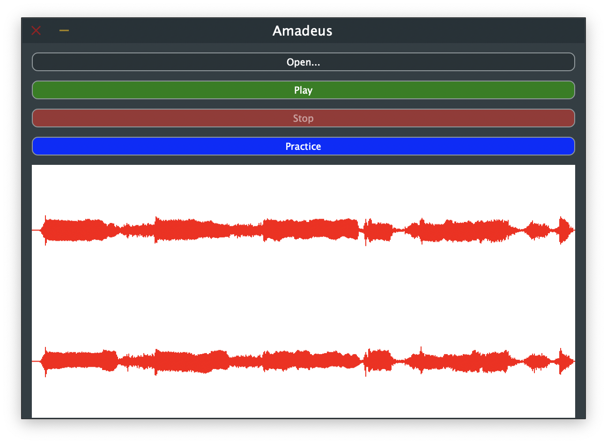

# Amadeus

Unleash your inner music prodigy by creating your own living, learning instrument. 

## Background

I believe the amazing research done by my colleagues on the [Magenta team](https://magenta.tensorflow.org/) on differentiable digital signal processing ([paper](https://arxiv.org/abs/2001.04643)) will have a profound effect on the music industry. 

While it has long  been possible to create new tones and textures by interpolating between different existing ones (example [paper](https://arxiv.org/abs/1906.06763) on using optimal transport), we can now use gradient optimization-based learning methods to guide the creation process. For example, some of the pretrained models available in the [DDSP repository](https://github.com/magenta/ddsp) have been trained by simply training an autoencoder-based model to learn the tone of the sound presented in a short (<10min) audio clip. While the authors have used very simple training regimes (eg. minimizing the multi-scale spectral loss of the generated sound w.r.t the target sound; see section 4.2.1 for details), they have left as an exercise to the reader more elaborate ways of training models that utilize DDSP components. 

Amadeus is an attempt to build a learning instrument that 1) gives users multiple ways of training it and 2) makes it extremely easy to be used as a virtual instrument in their favorite DAW.         

## Vision

An Amadeus instrument (a `deu`) learns and grows alongside its teacher (an `ama`).
Each `deu` has a unique and ever-evolving `personality` that shapes the sound it creates when played.
An `ama` shapes the `personality` of her `deu` through repeated `practice` sessions.
A `deu`'s `personality` can be observed (listened to) through a `performance` session.

There are three types of `practice` sessions:
- `imitation`: The `ama` provides examples of the desired sound they would like the `deu` to learn to emulate.
- `tuning`: The `ama` uses a set of knobs to tune the `deu`'s `personality` to directly guide her to produce a more desirable tone.
- `feedback`: The `ama` highlights specific good (or bad) parts of a performance to encourage (or discourage) the `deu` to produce certain tones.

A `performance` session allows the `ama` to play the `deu` with a (potentially MPE enabled) MIDI controller to create beautiful music, just like they would any other instrument.  

### Instrument Prototype UI

This is a prototype of the instrument component UI (Studio service not shown)

## Technical Design

### System Design

- There are 2 high-level components: `instrument` and  `studio`
- The `instrument` is the main UI, a JUCE-based VST/AU plugin that can be loaded in any DAW, Android, iOS, MacOS or Windows platform.
- The `instrument` has a hermetic, serializable state that describes its current  `personality` and a few other configs.  
- The `studio` is a gRPC service that provides 2 endpoints (`practice` and `perform`) allowing the `instrument` to learn and play.
- A `studio` service can be run locally inside  a Docker container, remotely on a machine with access to accelerators or as a hosted (paid) service.
- All `studio` instances are statesless so that an `instrument` is free to use different `studio`s for different `session`s.

### Learning

- Each `deu`'s `personality` contains a single DDSP SavedModel and some metadata
- Each `personality` also has a `learnerProfile` and a `playerProfile` that configures the hyperparams used for training and inference respectively
- Each `practice` session is implemented as a TFX pipeline run (except for some tuning sessions; see below)
    - `imitation` sessions are generic DDSP unsupervised training runs where the user provides the audio file(s) to train on 
    -  `tuning` sessions are changes to the `playerProfile` or changes to the `learnerProfile` followed by a rerun of the previous pipeline run
    - `feedback` sessions use the common characteristics of the regions on which positive/negative feedback was given to tune the 2 profiles  (currently not designed)

### UI

UI has three tabs: Practice, Play and Repair

- Practice UI is currently only designed for imitation sessions, where the use can
    - select and preview an audio file from their computer
    - ask the instrument to practice with the audio file
    - see whether there are any practice sessions taking place; when there are no practices taking place, the user knows the instrument is up to date (the local model is the latest trained model)
- Play UI allows the user to use the Instrument  to play just like any other virtual instrument
    - Using a MPE-enabled MIDI controller, the user provides a sequence of events that the Instrument plays in real time using its learned sound  
- Repair is the "settings" tab, where the user can
    - Register at a new Studio (providing the address of the Studio gRPC service)
    - Select which of the registered Studios the Instrument is currently using
    - Other configurations (like the path for where instrument data should be saved on disk) 
